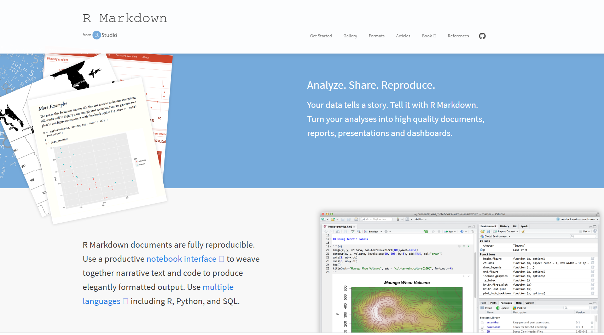
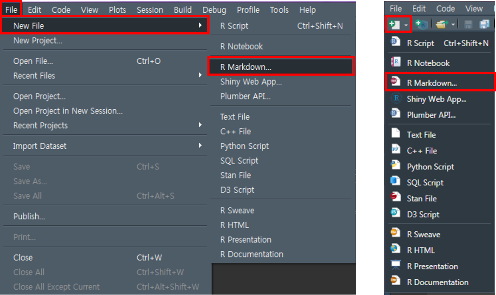
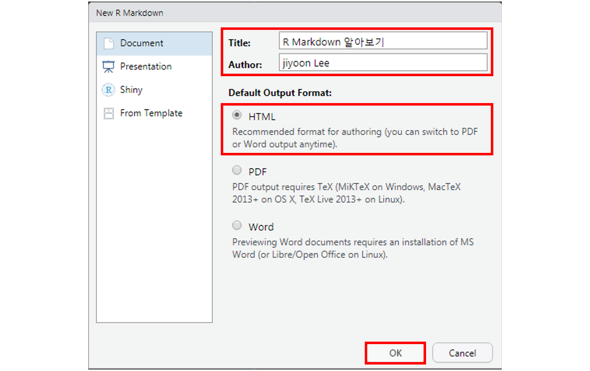
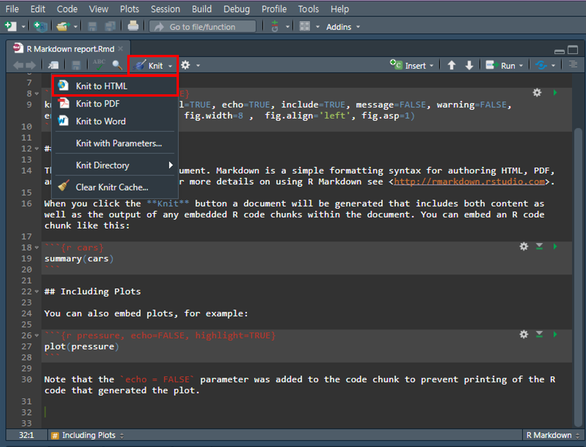
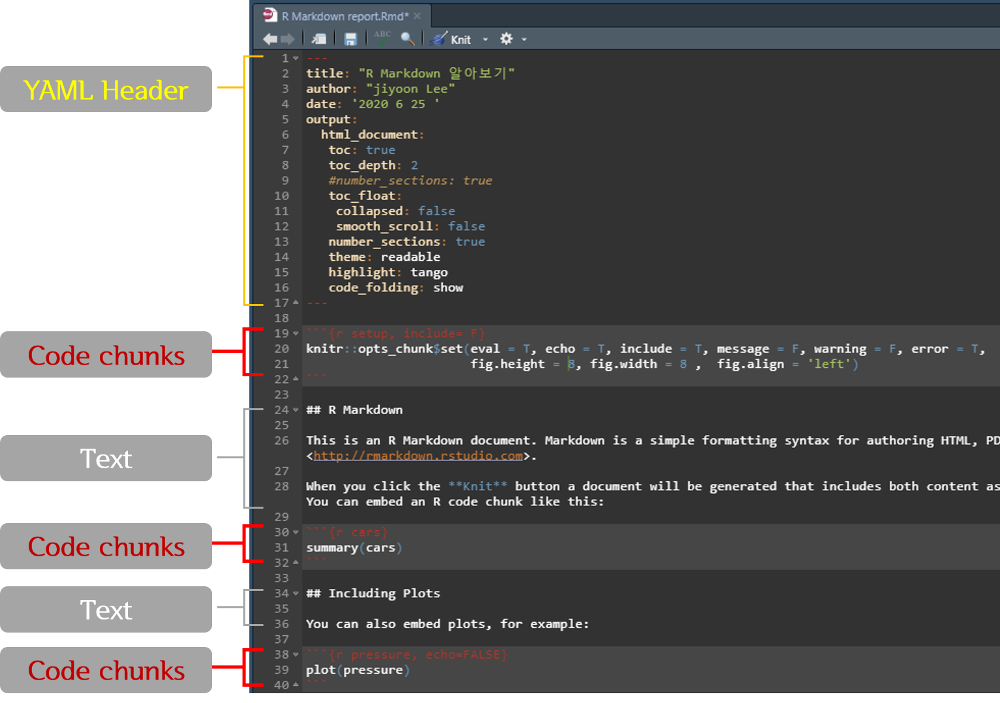
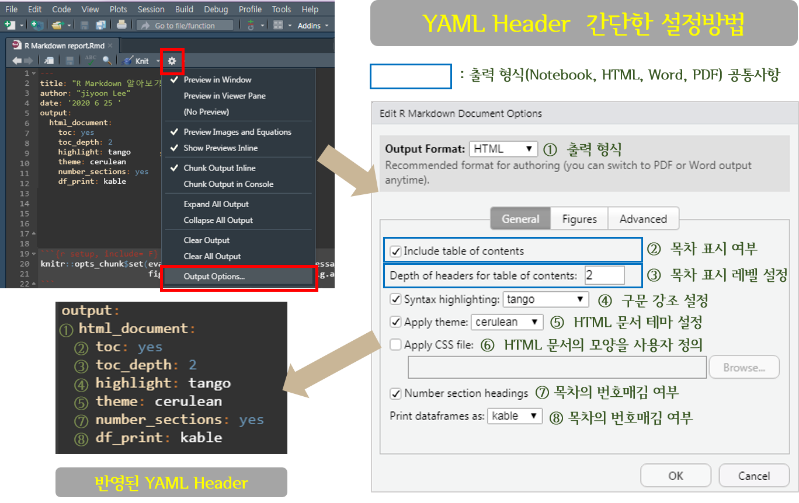

***

R Markdown은 데이터 과학을 위한 저작 프레임 워크를 제공한다. R Markdown 파일을 사용하여 코드 저장 및 실행을 할 수 있으며 생성된 문서는 매번 재현 가능하며 수십 가지 정적 및 동적 출력 형식을 지원한다. R Markdown은 무료이며 오픈 소스로 CRAN에서 R Markdown 패키지를 설치할 수 있다.  
<br>
__[목차]__  
__1. R Markdown 소개 및 설치__    
__2. Rmd 파일 구조 및 작성__
<br>
     
***   
   
# . R Markdown 소개 및 설치   
   
## . R Markdown 소개     
     
R Studio를 사용해서 R code와 함께 텍스트를 혼합해서 HTML, PDF, MS Word 등의 다양한 형태의 문서를 만들수 있다. 데이터, 통계분석 코드와 텍스트가 수미일관되게 하나의 문서 안에서 관리될 수 있다면 버전 관리의 어려움을 덜 수 있어서 재현가능한 연구(Reproducible Research) 관점에서 매우 유용하다. R Markdown은 무료이며 오픈 소스로 CRAN에서 R Markdown 패키지를 설치할 수 있다.   
    
__그림 1. R Markdown 소개__
   
R Markdown은 생성된 .rmd 파일을 ['knitr'](https://www.rdocumentation.org/packages/knitr/versions/1.28)에 공급하여 모든 코드 청크를 실행하고, 코드 및 출력을 포함하는 새 markdown(.md) 문서를 만든다. 이렇게 생성된 markdown(.md) 파일은 ['pandoc'](http://pandoc.org/)에 의해 처리 된다.   
   
__그림 2. R Markdown 처리순서__
   
   
## . R Markdown 설치 및 설정

### . knitr, rmarkdown, pandoc package 설치하기
  
['knitr'](https://www.rdocumentation.org/packages/knitr/versions/1.28), ['rmarkdown'](https://www.rdocumentation.org/packages/rmarkdown/versions/2.3) 패키지를 설치하고 선언하였다.  ['pandoc'](http://pandoc.org/)은 R studio를 설치할때 기본적으로 설치된다.  


```r
# Download and install knitr, rmarkdown packages from CRAN
install.packages("knitr")
install.packages("rmarkdown")
```
  

```r
# Load the package into the session making all its functoins available to use
library(knitr)
library(rmarkdown)
```

### . Rmd 파일 만들기  
  
* **"File > New File > R Markdown..." 메뉴를 선택**하거나 "File" 메뉴 아래의 **"New file" 아이콘을 선택하고 "R Markdown..." 선택**해서 .rmd 파일을 만든다.  
  
  
__그림 3. .rmd 파일 생성(1)__
  
<br> 

* 새롭게 만들어질 .rmd 파일의 **제목(Title)과 저자(Author)입력** 후 **기본 출력 포맷(Default Output Format)을 선택**한다.
  
  
__그림 4. .rmd 파일 생성(2)__
  
<br> 

* 아래와 같이 .rmd file이 만들어 지고, 저자는 **markdown 문법에 맞추어 작성**한다. .rmd 작성법 및 문법은 아래 *2. .rmd files 구조 및 작성*에서 다루도록 하겠다. 
  
  
__그림 5. .rmd 파일 생성(3)__
  
<br> 
  
* 작성된 .rmd 파일을 **"Knit" 아이콘**을 선택하여 .md 파일을 생성한다. 
  
  
__그림 6. R Markdown 실행__
   
* .md 파일을 생성시 `render` 함수를 사용할 수 있으며, **표 1**과 같이 출력값에 따라 다양한 포맷으로 생성할 수 있다.   
   
   

```r
# Render a single format
library(rmarkdown)
render("R Markdown report", "html_document")
```
   
   
<table class="table table-striped" style="font-size: 12px; margin-left: auto; margin-right: auto;">
<caption style="font-size: initial !important;">표 1. `render` 함수 사용시 출력값에 따른 생성포맷</caption>
 <thead>
  <tr>
   <th style="text-align:center;"> 출력값(output value) </th>
   <th style="text-align:center;"> 생성 포맷(creates) </th>
  </tr>
 </thead>
<tbody>
  <tr>
   <td style="text-align:center;"> html_document </td>
   <td style="text-align:center;"> html </td>
  </tr>
  <tr>
   <td style="text-align:center;"> pdf_document </td>
   <td style="text-align:center;"> pdf (requires Tex) </td>
  </tr>
  <tr>
   <td style="text-align:center;"> word_document </td>
   <td style="text-align:center;"> Microsof Word (.docx) </td>
  </tr>
  <tr>
   <td style="text-align:center;"> odt_document </td>
   <td style="text-align:center;"> OpenDocument Text </td>
  </tr>
  <tr>
   <td style="text-align:center;"> rtf_document </td>
   <td style="text-align:center;"> Rich Text Format </td>
  </tr>
  <tr>
   <td style="text-align:center;"> md_document </td>
   <td style="text-align:center;"> Markdown </td>
  </tr>
  <tr>
   <td style="text-align:center;"> github_document </td>
   <td style="text-align:center;"> Github compatible markdown </td>
  </tr>
  <tr>
   <td style="text-align:center;"> ioslides_presentation </td>
   <td style="text-align:center;"> ioslides HTML slides </td>
  </tr>
  <tr>
   <td style="text-align:center;"> slidy_presentation </td>
   <td style="text-align:center;"> slidy HTML slides </td>
  </tr>
  <tr>
   <td style="text-align:center;"> beamer_presentation </td>
   <td style="text-align:center;"> Beamer pdf slides (requires Tex) </td>
  </tr>
</tbody>
</table>
   
   
# . Rmd 파일 구조 및 작성  
  
## . Rmd 파일 구조   
  
.rmd 파일은 크게 **YAML Header**, **Code chunk**, **Text**로 나뉜다.  
  
__그림 7. .rmd 파일 구조__
   
<br>
  
### . YAML Header
  
YAML(YAML Ain’t Markup Language)은 R markdown의 .rmd 파일 상단에 문서 형식을 설정한다.  
  
__그림 8. YAML head 설정방법__  
   
<br>
  
### . Code chunk  
  
 > 전체 code chunk 설정      

.rmd 파일을 생성시 문서 전체에 적용할 수 있는 chunk 옵션이 "setup"이라는 **코드 묶음 명칭(code chunk label)** 으로 최초 설정되었다. 
  

  
  
`knitr::opts_chunk$set()`을 사용해 작성자는 문서 전체에 대해 code chunk를 설정할 수 있으며 개별적인 code chunk에서 옵션을 반복할 필요가 없다. 기본적으로 많이 사용하는 chunk 옵션은 **표 2** 에 나타내었다.    


    
<br>    
<table class="table table-striped" style="font-size: 12px; margin-left: auto; margin-right: auto;">
<caption style="font-size: initial !important;">표 2. code chunk에서 많이 사용되는 옵션</caption>
 <thead>
  <tr>
   <th style="text-align:center;"> 선택옵션 </th>
   <th style="text-align:center;"> 기본설정 </th>
   <th style="text-align:left;"> 효과 </th>
  </tr>
 </thead>
<tbody>
  <tr>
   <td style="text-align:center;"> eval </td>
   <td style="text-align:center;"> TRUE </td>
   <td style="text-align:left;"> 코드를 평가하고 실행결과를 포함한다. </td>
  </tr>
  <tr>
   <td style="text-align:center;"> echo </td>
   <td style="text-align:center;"> TRUE </td>
   <td style="text-align:left;"> 실행결과와 함께 코드를 출력한다. </td>
  </tr>
  <tr>
   <td style="text-align:center;"> include </td>
   <td style="text-align:center;"> FALSE </td>
   <td style="text-align:left;"> 실행 결과를 보여주지 않는다. </td>
  </tr>
  <tr>
   <td style="text-align:center;"> warning </td>
   <td style="text-align:center;"> TRUE </td>
   <td style="text-align:left;"> 경고메시지를 출력한다. </td>
  </tr>
  <tr>
   <td style="text-align:center;"> error </td>
   <td style="text-align:center;"> FALSE </td>
   <td style="text-align:left;"> 오류메시지를 출력한다. </td>
  </tr>
  <tr>
   <td style="text-align:center;"> message </td>
   <td style="text-align:center;"> TRUE </td>
   <td style="text-align:left;"> 메시지를 출력한다. </td>
  </tr>
  <tr>
   <td style="text-align:center;"> tidy </td>
   <td style="text-align:center;"> FALSE </td>
   <td style="text-align:left;"> 깔끔한 방식으로 코드 형태를 변형한다. </td>
  </tr>
  <tr>
   <td style="text-align:center;"> results </td>
   <td style="text-align:center;"> markup </td>
   <td style="text-align:left;"> markup/asis/hold/hide </td>
  </tr>
  <tr>
   <td style="text-align:center;"> cache </td>
   <td style="text-align:center;"> FALSE </td>
   <td style="text-align:left;"> 결과값을 캐쉬해서 향후 실행시 건너뛰게 설정한다. </td>
  </tr>
  <tr>
   <td style="text-align:center;"> comment </td>
   <td style="text-align:center;"> ## </td>
   <td style="text-align:left;"> 주석문자로 출력결과에 서두를 붙인다. </td>
  </tr>
  <tr>
   <td style="text-align:center;"> fig.width </td>
   <td style="text-align:center;"> 7 </td>
   <td style="text-align:left;"> R로 생성되는 그래프에 대한 폭을 인치로 지정한다. </td>
  </tr>
  <tr>
   <td style="text-align:center;"> fig.height </td>
   <td style="text-align:center;"> 7 </td>
   <td style="text-align:left;"> R로 생성되는 그래프에 대한 높이를 인치로 지정한다. </td>
  </tr>
  <tr>
   <td style="text-align:center;"> fig.align </td>
   <td style="text-align:center;"> center </td>
   <td style="text-align:left;"> R로 생성되는 그래프에 대한 위치를 지정한다(center, left, right). </td>
  </tr>
</tbody>
</table>

전체 옵션은 `knitr::opts_chunk$get()` 함수로 확인할 수 있다.  


  
 > 개별 code chunk 설정      
  
```{r code chunk label, chunk option1, chunk option2, ... }```와 ``` '''  ```  사이에 markup에서 실행될 코드를 작성하면 개별적으로 **코드 묶음(code chunk)**를 작성할 수 있다.   

작성시 R **코드 묶음 명칭(code chunk label)**을 부여하는 것이 오류파악 및 수정시 편리하고 그래프가 생성되는 경우 파일명이 R 코드 묶음 명칭이 기본값으로 지정된다.   

~~예를 들어 코드는 숨기고 결과만 보여주려면 `echo = F`를 추가하면 된다.~~  

### . Text  
~~작성해야합니다.~~
  
## . Rmd 파일 작성  


### . Markdown Syntax   
[R markdown Gallery](https://rmarkdown.rstudio.com/articles.html)의 다양한 문서들중 
[Cheat Sheet](https://github.com/rstudio/cheatsheets/raw/master/rmarkdown-2.0.pdf)
[Reference Guide](https://www.rstudio.com/wp-content/uploads/2015/03/rmarkdown-reference.pdf?_ga=2.166048702.1072460106.1593844062-326479530.1590640653)를 통해 더 정확하고 자세한 작성문법을 제공한다.    

<br>

### . Plot & Image   
R로 작성된 Plot의 물리적 크기는 chunk 옵션의 `fig.width`과 `fig.height`로 제어할 수 있다. 그리고  `fig.dim` 을 사용하여 너비(width)와 높이(height)를 한번에 정의 할 수도 있다(예 : `fig.dim = c(8, 6)`은 `fig.width = 8`및 `fig.height = 6`을 말한다.).   
또 chunk 옵션의 `out.width`및 `out.height`을 사용해서 출력되는 plot의 크기를 다른크기로 제어할 수 있다(예: `out.width = "50%"`).    
    
R 코드 chunk 에서 Plot 또는 Image가 생성되지 않으면 아래 두가지 방법으로 포함시킬 수 있다.    
    
    
* Markdown 구문 사용   

  * ``   


<br>

* `knitr` 함수 사용   

  * `knitr::include_graphics()` : `out.width`, `fig.align`등 chunk 옵션 사용
    
  
<br>    


### . Table   
   
~~HTML, PDF 및 Word에서 표(Table)를 포함하는 쉬운 방법은 `knitr::kable()`을 사용하는 것이다. caption 예를 들어, 함수에 전달 하여 테이블 캡션을 포함 할 수 있습니다. 테이블 스타일링에 대한 고급 제어를 원하는 경우 kableExtra 패키지 를 사용하여 PDF 및 HTML 테이블의 모양을 사용자 정의하는 기능을 제공~~ 
https://bookdown.org/yihui/rmarkdown-cookbook/kable.html
   
https://bookdown.org/yihui/rmarkdown-cookbook/kableextra.html
https://cran.r-project.org/web/packages/kableExtra/vignettes/awesome_table_in_html.html#position 
   

  
