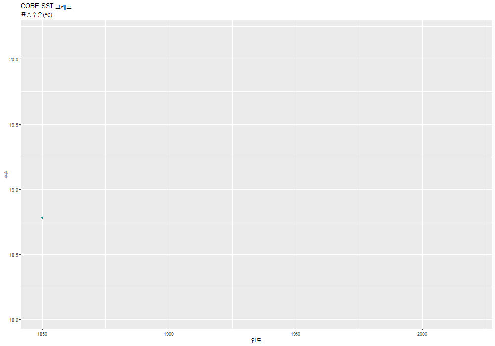

# ggplot() 래스터 이미지 애니메이션으로 만들기

<!-- 첫 h1이 씨랩 글제목이 됩니다. 블럭 아닌 구간에서 샵(#) 하나 = 헤딩1(h1) -->

이번 튜토리얼에서는
[`gganimate`](https://www.rdocumentation.org/packages/gganimate/versions/1.0.5)
패키지를 사용하여 `ggplot()` 그래프를 애니메이션으로 제작하는 방법을
설명하고자 한다. 

*-* 참고하면 좋을 튜토리얼 *–*

-   [‘R을 이용한 NetCDF데이터 확인하기’](http://sealab.kesti.info/view/30)  
-   [‘R을 이용한 데이터프레임 셋 래스터그리기’](http://sealab.kesti.info/view/28)  
-   [‘R을 이용한 표층수온 시계열 그래프 그리기’](http://sealab.kesti.info/view/29)  


튜토리얼에 사용될 데이터는
[COBE-SST2](https://psl.noaa.gov/data/gridded/data.cobe2.html) nc파일의 표층수온 데이터이며 튜토리얼은 아래와 같이 진행된다.

__[목차]__  

__1. `ggplot()` 래스터, 애니메이션으로 만들기__<br/>
__2. `ggplot()` 시계열 그래프 애니메이션으로 그리기__<br/>
__3. 애니메이션 저장하기__

------------------------------------------------------------------------

# `ggplot()` 래스터 이미지 애니메이션으로 만들기

------------------------------------------------------------------------

먼저, COBE 자료의 표층수온 래스터를 애니메이션으로 만드는 방법에 대해
설명하겠다. nc파일의 데이터로 래스터 이미지 그리는 방법은 ‘R을 이용한
NetCDF데이터 확인하기’와 ’R을 이용한 데이터프레임 셋 래스터그리기’
튜토리얼을 참고하기 바란다.

우선, 애니메이션 제작을 위해서는
[`gganimate`](https://www.rdocumentation.org/packages/gganimate/versions/1.0.5)
패키지를 설치하고 선언해야한다.

``` r
install.packages("gganimate")
```

애니메이션으로 만들 때에는 작성한 `ggplot()` 코드에
[`labs()`](https://www.rdocumentation.org/packages/ggplot2/versions/3.3.0/topics/labs),
[`transition_time()`](https://www.rdocumentation.org/packages/gganimate/versions/1.0.5/topics/transition_time),
함수를 추가하여 실행시킬 수 있다. `transition_time()`함수는 시간에
해당하는 변수를 지정하는 함수로, 지정한 시간 단위로 프레임이 만들어진다.
`labs()`함수는 애니메이션 프레임의 제목을 삽입할 수 있으며 함수 안에
`{frame_time}` 를 입력하면 각 프레임에 해당하는 시간을 표출할 수 있다.

``` r
library(ggplot2)
library(dplyr)
library(colorRamps)
library(maps)
library(mapdata)
library(gganimate)

ggplot(subset(cobe %>% group_by(as.integer(format(cobe$date, "%Y")), lon, lat) %>% 
                summarise_at(.vars = "SST", .funs=mean)),
       aes(x=`lon`, y=`lat`, z=SST)) +
  geom_raster(aes(fill=SST), interpolate=TRUE) +
  scale_fill_gradientn(colours = matlab.like(50))+
  borders(fill="grey",colour="grey", xlim = xlims, ylim=ylims) +
  coord_fixed(xlim = xlims,ylim=ylims) +
  #애니메이션 시간에 해당하는 변수
  transition_time(`as.integer(format(cobe$date, "%Y"))`) +
  #애니메이션 프레임 제목
  labs(title='{frame_time}년') +
  #화면전환 방법
  enter_fade()
```


연도/월 별 래스터 애니메이션을 그리고 싶을 때에는 `subset()` 함수에서
평균을 구하는 `group_by()`조건에 ’월’을 추가로 입력 후
`ggplot()`코드에서 `facet_wrap()`함수에 ’월’을 작성하면 된다.

``` r
library(ggplot2)
library(dplyr)
library(colorRamps)
library(maps)
library(mapdata)
library(gganimate)

ggplot(subset(cobe %>% group_by(as.integer(format(cobe$date, "%Y")), 
                                as.integer(format(cobe$date, "%m")), lon, lat) %>%
                summarise_at(.vars = "SST", .funs=mean)),
       aes(x=`lon`, y=`lat`, z=SST)) +
  geom_raster(aes(fill=SST), interpolate=TRUE) +
  scale_fill_gradientn(colours = matlab.like(50))+
  borders(fill="grey",colour="grey", xlim = xlims, ylim=ylims) +
  coord_fixed(xlim = xlims,ylim=ylims) +
  #월별 래스터 애니메이션 보기
  facet_wrap(~`as.integer(format(cobe$date, "%m"))`) +
  #애니메이션 시간에 해당하는 변수
  transition_time(`as.integer(format(cobe$date, "%Y"))`) +
  #애니메이션 프레임 제목
  labs(title='{frame_time}년')
```

  

------------------------------------------------------------------------

# `ggplot()` 시계열 그래프 애니메이션으로 그리기

------------------------------------------------------------------------

이번엔 COBE 자료의 표층수온 시계열 그래프를 애니메이션으로 그려보겠다.
시계열 그래프 그리는 방법은 ‘R을 이용한 표층수온 시계열 그래프 그리기’
튜토리얼을 참고하기 바란다.

`gganimate`패키지의
[`transition_reveal()`](https://www.rdocumentation.org/packages/gganimate/versions/1.0.5/topics/transition_reveal)함수를
이용하면 선그래프를 조건에 따라 점차적으로 나타나게 할 수 있다.

``` r
library(ggplot2)
library(dplyr)
library(gganimate)

ggplot(subset(cobe %>% group_by(as.integer(format(cobe$date, "%Y"))) %>%
                  summarise_at(.vars = "SST", .funs=mean)),
         aes(x=`as.integer(format(cobe$date, "%Y"))`, y=`SST`)) +
    geom_line(color="#22908c") +
    # 'aes()' 함수를 지정하면 포인트를 유지할 수 있음
    geom_point(color="#22908c", aes(group=`SST`))+
    labs(title="COBE SST 그래프", 
         subtitle="표층수온(ºC)", x="연도", y="수온")+
    transition_reveal(`as.integer(format(cobe$date, "%Y"))`)
```

  

------------------------------------------------------------------------

# 애니메이션 저장하기

------------------------------------------------------------------------

애니메이션을 저장하고자 할 때에는
[`gifski`](https://www.rdocumentation.org/packages/gifski/versions/0.8.6/topics/gifski)패키지의
설치와 선언을 해야한다. 먼저, `p`라는 변수에 앞서 만든 `ggplot()`
애니메이션을 저장 후
[`animate()`](https://www.rdocumentation.org/packages/gganimate/versions/1.0.5/topics/animate)
함수를 사용하여 초당 프레임 수, 애니메이션 크기, 재생속도, 되감기 여부,
저장 경로 등을 지정하여 저장한다.

``` r
install.packages("gifski")
```

``` r
library(ggplot2)
library(dplyr)
library(colorRamps)
library(maps)
library(mapdata)
library(gganimate)
library(gifski)

p <- ggplot(subset(cobe %>% group_by(as.integer(format(cobe$date, "%Y")), lon, lat) %>% 
                summarise_at(.vars = "SST", .funs=mean)),
       aes(x=`lon`, y=`lat`, z=SST)) +
  geom_raster(aes(fill=SST), interpolate=TRUE) +
  scale_fill_gradientn(colours = matlab.like(50))+
  borders(fill="grey",colour="grey", xlim = xlims, ylim=ylims) +
  coord_fixed(xlim = xlims,ylim=ylims) +
  transition_time(`as.integer(format(cobe$date, "%Y"))`) +
  labs(title='{frame_time}년', x = "lon", y = "lat") +
  enter_fade()

#애니메이션 저장하기
animate(p, 
        # 초당 프레임 수 지정
        fps=10, 
        # 너비, 높이 지정
        width= 1000, height=1000,
        # 애니메이션에 사용할 래스터 프레임 수(기본값:100)
        nframe= 170,
        # 되감기 여부 (기본값:False)
        rewind= F,
        # 저장할 파일 경로 및 파일명 지정
        renderer = gifski_renderer("C:/Users/User/Documents/R/test.gif"))
```

이상으로 “R을 이용한 애니메이션 제작하기” 튜토리얼을 마치도록 하겠다.
