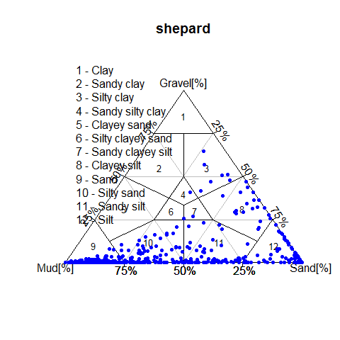
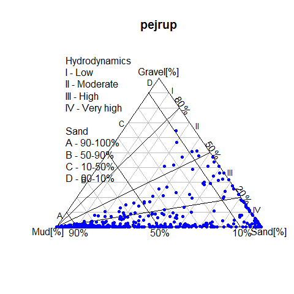
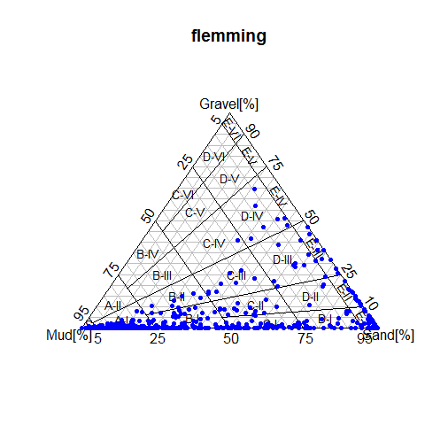

# R을 이용한 우리나라 저질구분 Diaram 만들기

<!-- 첫 h1이 씨랩 글제목이 됩니다. 블럭 아닌 구간에서 샵(#) 하나 = 헤딩1(h1) -->

이전 포스팅 "R을 이용한 퇴적물 입도조성 자료 시각화 하기(1)"에서는 [`rysgran`](https://www.rdocumentation.org/packages/rysgran/versions/2.1.0)을 사용해서 해양저질 퇴적물 자료의 입도조성을 분류했다. 분류방법은 `shepard`, `pejrup`, `flemming`으로 **그림 1**과 같다.    





그러나 이 분류방법은 우리나라 국가법령정보센터에서 제공하는 __수로측량 업무규정 제 49조(자료이 해석)__ 의 "저질 분류 Diagram"와 다르다(__그림 2__). "저질 분류 Diagram"은 _"자갈(Gravel)이 포함된 경우"_ 와 _"자갈이 포함되지 않은 경우"_ 로 나누어 분류한다.


해양저질 퇴적물의 입도조성 자료를 우리나라 기준에 맞추어 도시화 할 수 있도록 이번 포스팅에서는 [`ggtern`](https://www.rdocumentation.org/packages/rysgran/versions/2.1.0) 과 [`plyr`](https://www.rdocumentation.org/packages/plyr/versions/1.8.6) 를 사용해서 우리나라 저질 분류 Diagram을 만들었다. 튜토리얼 순서는 아래와 같다.    

__[목차]__  

__1. R Package “ggtern”, "dyply" 소개 및 설치__  

__2. 우리나라 저질 분류 Diagram 만들기__    

***    

# . R Package “ggtern”, "dyply" 소개 및 설치  
  
## . R Package “ggtern”, "dyply" 소개   

[`ggtern`](https://www.rdocumentation.org/packages/ggtern/versions/2.2.0)는 [`ggplot2`](https://www.rdocumentation.org/packages/ggplot2/versions/3.3.1)의 기능을 확장하여 [`ggplot2`](https://www.rdocumentation.org/packages/ggplot2/versions/3.3.1) 지오메트리에 대한 3차 다이어그램을 그릴 수 있는 기능을 제공하면서 [`ggtern`](https://www.rdocumentation.org/packages/ggtern/versions/2.2.0)은 표준 [`ggplot2`](https://www.rdocumentation.org/packages/ggplot2/versions/3.3.1)에서 사용할 수 없는 몇 가지 새로운 형상을 구현하는 확장판이다.    
<br>    
    
## . R Package “ggtern”, "dyply" 설치   

[`ggtern`](https://www.rdocumentation.org/packages/rysgran/versions/2.1.0), [`plyr`](https://www.rdocumentation.org/packages/plyr/versions/1.8.6)패키지를 설치하고 선언하였다.


```r
# Download and install a package from CRAN
install.packages("ggtern")
install.packages("plyr")
```


```r
# Load the package into the session making all its functoins available to use
library(ggtern)
library(plyr)
```


# . 저질 분류 Diagram 만들기

## . 저질기준 분류표 불러오기    

`setwd`함수로 "저질기준 분류표(자갈이 포함된 경우)"가 저장된 경로로 설정하고 `read.table` 함수로 데이터를 불러왔다.    


```r
setwd("G:/R/Rmarkdown/02.ggtern_sediment/00.data")
#Load the data into a table using the read.table function
data01 <- read.table("Textural Classification(with gravel).csv", header = TRUE, sep = ",")
View(data01)
```

<div style="border: 1px solid #ddd; padding: 0px; overflow-y: scroll; height:500px; "><table class="table table-striped" style="font-size: 12px; margin-left: auto; margin-right: auto;">
<caption style="font-size: initial !important;">표 1. 불러온 저질기준 분류표(자갈이 포함된 경우 상위20개)</caption>
 <thead>
  <tr>
   <th style="text-align:left;position: sticky; top:0; background-color: #FFFFFF;">   </th>
   <th style="text-align:center;position: sticky; top:0; background-color: #FFFFFF;"> X </th>
   <th style="text-align:center;position: sticky; top:0; background-color: #FFFFFF;"> Gravel </th>
   <th style="text-align:center;position: sticky; top:0; background-color: #FFFFFF;"> Mud </th>
   <th style="text-align:center;position: sticky; top:0; background-color: #FFFFFF;"> Sand </th>
   <th style="text-align:center;position: sticky; top:0; background-color: #FFFFFF;"> Label </th>
  </tr>
 </thead>
<tbody>
  <tr>
   <td style="text-align:left;"> 1 </td>
   <td style="text-align:center;"> 1 </td>
   <td style="text-align:center;"> 1.00 </td>
   <td style="text-align:center;"> 0.00 </td>
   <td style="text-align:center;"> 0.00 </td>
   <td style="text-align:center;"> G </td>
  </tr>
  <tr>
   <td style="text-align:left;"> 2 </td>
   <td style="text-align:center;"> 2 </td>
   <td style="text-align:center;"> 0.80 </td>
   <td style="text-align:center;"> 0.20 </td>
   <td style="text-align:center;"> 0.00 </td>
   <td style="text-align:center;"> G </td>
  </tr>
  <tr>
   <td style="text-align:left;"> 3 </td>
   <td style="text-align:center;"> 3 </td>
   <td style="text-align:center;"> 0.80 </td>
   <td style="text-align:center;"> 0.00 </td>
   <td style="text-align:center;"> 0.20 </td>
   <td style="text-align:center;"> G </td>
  </tr>
  <tr>
   <td style="text-align:left;"> 4 </td>
   <td style="text-align:center;"> 4 </td>
   <td style="text-align:center;"> 0.80 </td>
   <td style="text-align:center;"> 0.20 </td>
   <td style="text-align:center;"> 0.00 </td>
   <td style="text-align:center;"> mG </td>
  </tr>
  <tr>
   <td style="text-align:left;"> 5 </td>
   <td style="text-align:center;"> 5 </td>
   <td style="text-align:center;"> 0.30 </td>
   <td style="text-align:center;"> 0.70 </td>
   <td style="text-align:center;"> 0.00 </td>
   <td style="text-align:center;"> mG </td>
  </tr>
  <tr>
   <td style="text-align:left;"> 6 </td>
   <td style="text-align:center;"> 6 </td>
   <td style="text-align:center;"> 0.30 </td>
   <td style="text-align:center;"> 0.35 </td>
   <td style="text-align:center;"> 0.35 </td>
   <td style="text-align:center;"> mG </td>
  </tr>
  <tr>
   <td style="text-align:left;"> 7 </td>
   <td style="text-align:center;"> 7 </td>
   <td style="text-align:center;"> 0.80 </td>
   <td style="text-align:center;"> 0.10 </td>
   <td style="text-align:center;"> 0.10 </td>
   <td style="text-align:center;"> mG </td>
  </tr>
  <tr>
   <td style="text-align:left;"> 8 </td>
   <td style="text-align:center;"> 8 </td>
   <td style="text-align:center;"> 0.80 </td>
   <td style="text-align:center;"> 0.10 </td>
   <td style="text-align:center;"> 0.10 </td>
   <td style="text-align:center;"> mSG </td>
  </tr>
  <tr>
   <td style="text-align:left;"> 9 </td>
   <td style="text-align:center;"> 9 </td>
   <td style="text-align:center;"> 0.30 </td>
   <td style="text-align:center;"> 0.35 </td>
   <td style="text-align:center;"> 0.35 </td>
   <td style="text-align:center;"> mSG </td>
  </tr>
  <tr>
   <td style="text-align:left;"> 10 </td>
   <td style="text-align:center;"> 10 </td>
   <td style="text-align:center;"> 0.30 </td>
   <td style="text-align:center;"> 0.07 </td>
   <td style="text-align:center;"> 0.63 </td>
   <td style="text-align:center;"> mSG </td>
  </tr>
  <tr>
   <td style="text-align:left;"> 11 </td>
   <td style="text-align:center;"> 11 </td>
   <td style="text-align:center;"> 0.80 </td>
   <td style="text-align:center;"> 0.02 </td>
   <td style="text-align:center;"> 0.18 </td>
   <td style="text-align:center;"> mSG </td>
  </tr>
  <tr>
   <td style="text-align:left;"> 12 </td>
   <td style="text-align:center;"> 12 </td>
   <td style="text-align:center;"> 0.80 </td>
   <td style="text-align:center;"> 0.02 </td>
   <td style="text-align:center;"> 0.18 </td>
   <td style="text-align:center;"> SG </td>
  </tr>
  <tr>
   <td style="text-align:left;"> 13 </td>
   <td style="text-align:center;"> 13 </td>
   <td style="text-align:center;"> 0.30 </td>
   <td style="text-align:center;"> 0.07 </td>
   <td style="text-align:center;"> 0.63 </td>
   <td style="text-align:center;"> SG </td>
  </tr>
  <tr>
   <td style="text-align:left;"> 14 </td>
   <td style="text-align:center;"> 14 </td>
   <td style="text-align:center;"> 0.30 </td>
   <td style="text-align:center;"> 0.00 </td>
   <td style="text-align:center;"> 0.70 </td>
   <td style="text-align:center;"> SG </td>
  </tr>
  <tr>
   <td style="text-align:left;"> 15 </td>
   <td style="text-align:center;"> 15 </td>
   <td style="text-align:center;"> 0.80 </td>
   <td style="text-align:center;"> 0.00 </td>
   <td style="text-align:center;"> 0.20 </td>
   <td style="text-align:center;"> SG </td>
  </tr>
  <tr>
   <td style="text-align:left;"> 16 </td>
   <td style="text-align:center;"> 16 </td>
   <td style="text-align:center;"> 0.30 </td>
   <td style="text-align:center;"> 0.70 </td>
   <td style="text-align:center;"> 0.00 </td>
   <td style="text-align:center;"> gM </td>
  </tr>
  <tr>
   <td style="text-align:left;"> 17 </td>
   <td style="text-align:center;"> 17 </td>
   <td style="text-align:center;"> 0.05 </td>
   <td style="text-align:center;"> 0.95 </td>
   <td style="text-align:center;"> 0.00 </td>
   <td style="text-align:center;"> gM </td>
  </tr>
  <tr>
   <td style="text-align:left;"> 18 </td>
   <td style="text-align:center;"> 18 </td>
   <td style="text-align:center;"> 0.05 </td>
   <td style="text-align:center;"> 0.48 </td>
   <td style="text-align:center;"> 0.48 </td>
   <td style="text-align:center;"> gM </td>
  </tr>
  <tr>
   <td style="text-align:left;"> 19 </td>
   <td style="text-align:center;"> 19 </td>
   <td style="text-align:center;"> 0.30 </td>
   <td style="text-align:center;"> 0.35 </td>
   <td style="text-align:center;"> 0.35 </td>
   <td style="text-align:center;"> gM </td>
  </tr>
  <tr>
   <td style="text-align:left;"> 20 </td>
   <td style="text-align:center;"> 20 </td>
   <td style="text-align:center;"> 0.30 </td>
   <td style="text-align:center;"> 0.35 </td>
   <td style="text-align:center;"> 0.35 </td>
   <td style="text-align:center;"> gmS </td>
  </tr>
</tbody>
</table></div>
    
같은 "Label" 값을 가진 데이터(점)끼리 그룹을 지어 polygon을 만들면 저질분류 Diagram에 표시될 각 구역을 구분지을 수 있다.    
    
* `ddply` 함수를 사용해서 "Label"이라는 컬럼으로 데이터를 묶은 다음에 `df` 함수를 사용해서 데이터프레임을 만든다. `apply` 함수를 사용해서 열방향(2)으로 평균값(`maen` 함수)을 구한다.    
* 저질 분류 Diagram의 polygon에 표시될 "Label"의 각도를 표현하기 위해서 먼저 `swithch` 함수를 사용해서 "Label" 값이  "M"인 경우는 "-10"을, "S"일 경우에는 "10"을, 이 두가지 경우에 해당하지 않을때는 "0"을 새롭게 생성된 "Angle"이라는 컬럼에 채우고, 이를  `sapply` 함수를 사용해서 벡터로 반환한다.        


```r
#Put tile labels at the midpoint of each tile.
data02 <- ddply(data01,"Label",function(df){apply(df[,2:4],2,mean)})
data02$Angle = sapply(as.character(data02$Label),function(x){switch(x,"M"=-10,"S"= 10, 0)})
View(data02)
```

<div style="border: 1px solid #ddd; padding: 0px; overflow-y: scroll; height:500px; ">
  <table class="table table-striped" style="font-size: 12px; margin-left: auto; margin-right: auto;">
    <caption style="font-size: initial !important;">표 2. 15개로 구분된 저질 구분표</caption>
  <thead>
    <tr>
    <th style="text-align:left;position: sticky; top:0; background-color: #FFFFFF;">   </th>
    <th style="text-align:center;position: sticky; top:0; background-color: #FFFFFF;"> Label </th>
    <th style="text-align:center;position: sticky; top:0; background-color: #FFFFFF;"> Gravel </th>
    <th style="text-align:center;position: sticky; top:0; background-color: #FFFFFF;"> Mud </th>
    <th style="text-align:center;position: sticky; top:0; background-color: #FFFFFF;"> Sand </th>
    <th style="text-align:center;position: sticky; top:0; background-color: #FFFFFF;"> Angle </th>
    </tr>
  </thead>
    <tbody>
      <tr>
      <td style="text-align:left;"> 1 </td>
      <td style="text-align:center;"> (g)M </td>
      <td style="text-align:center;"> 0.03 </td>
      <td style="text-align:center;"> 0.92 </td>
      <td style="text-align:center;"> 0.05 </td>
      <td style="text-align:center;"> 0 </td>
      </tr>
      <tr>
      <td style="text-align:left;"> 2 </td>
      <td style="text-align:center;"> (g)mS </td>
      <td style="text-align:center;"> 0.03 </td>
      <td style="text-align:center;"> 0.29 </td>
      <td style="text-align:center;"> 0.68 </td>
      <td style="text-align:center;"> 0 </td>
      </tr>
      <tr>
      <td style="text-align:left;"> 3 </td>
      <td style="text-align:center;"> (g)S </td>
      <td style="text-align:center;"> 0.03 </td>
      <td style="text-align:center;"> 0.05 </td>
      <td style="text-align:center;"> 0.92 </td>
      <td style="text-align:center;"> 0 </td>
      </tr>
      <tr>
      <td style="text-align:left;"> 4 </td>
      <td style="text-align:center;"> (g)sM </td>
      <td style="text-align:center;"> 0.03 </td>
      <td style="text-align:center;"> 0.68 </td>
      <td style="text-align:center;"> 0.29 </td>
      <td style="text-align:center;"> 0 </td>
      </tr>
      <tr>
      <td style="text-align:left;"> 5 </td>
      <td style="text-align:center;"> G </td>
      <td style="text-align:center;"> 0.87 </td>
      <td style="text-align:center;"> 0.07 </td>
      <td style="text-align:center;"> 0.07 </td>
      <td style="text-align:center;"> 0 </td>
      </tr>
      <tr>
      <td style="text-align:left;"> 6 </td>
      <td style="text-align:center;"> gM </td>
      <td style="text-align:center;"> 0.18 </td>
      <td style="text-align:center;"> 0.62 </td>
      <td style="text-align:center;"> 0.21 </td>
      <td style="text-align:center;"> 0 </td>
      </tr>
      <tr>
      <td style="text-align:left;"> 7 </td>
      <td style="text-align:center;"> gmS </td>
      <td style="text-align:center;"> 0.18 </td>
      <td style="text-align:center;"> 0.25 </td>
      <td style="text-align:center;"> 0.58 </td>
      <td style="text-align:center;"> 0 </td>
      </tr>
      <tr>
      <td style="text-align:left;"> 8 </td>
      <td style="text-align:center;"> gS </td>
      <td style="text-align:center;"> 0.18 </td>
      <td style="text-align:center;"> 0.04 </td>
      <td style="text-align:center;"> 0.78 </td>
      <td style="text-align:center;"> 0 </td>
      </tr>
      <tr>
      <td style="text-align:left;"> 9 </td>
      <td style="text-align:center;"> M </td>
      <td style="text-align:center;"> 0.00 </td>
      <td style="text-align:center;"> 0.95 </td>
      <td style="text-align:center;"> 0.05 </td>
      <td style="text-align:center;"> -10 </td>
      </tr>
      <tr>
      <td style="text-align:left;"> 10 </td>
      <td style="text-align:center;"> mG </td>
      <td style="text-align:center;"> 0.55 </td>
      <td style="text-align:center;"> 0.34 </td>
      <td style="text-align:center;"> 0.11 </td>
      <td style="text-align:center;"> 0 </td>
      </tr>
      <tr>
      <td style="text-align:left;"> 11 </td>
      <td style="text-align:center;"> mS </td>
      <td style="text-align:center;"> 0.00 </td>
      <td style="text-align:center;"> 0.30 </td>
      <td style="text-align:center;"> 0.70 </td>
      <td style="text-align:center;"> 0 </td>
      </tr>
      <tr>
      <td style="text-align:left;"> 12 </td>
      <td style="text-align:center;"> mSG </td>
      <td style="text-align:center;"> 0.55 </td>
      <td style="text-align:center;"> 0.14 </td>
      <td style="text-align:center;"> 0.32 </td>
      <td style="text-align:center;"> 0 </td>
      </tr>
      <tr>
      <td style="text-align:left;"> 13 </td>
      <td style="text-align:center;"> S </td>
      <td style="text-align:center;"> 0.00 </td>
      <td style="text-align:center;"> 0.05 </td>
      <td style="text-align:center;"> 0.95 </td>
      <td style="text-align:center;"> 10 </td>
      </tr>
      <tr>
      <td style="text-align:left;"> 14 </td>
      <td style="text-align:center;"> SG </td>
      <td style="text-align:center;"> 0.55 </td>
      <td style="text-align:center;"> 0.02 </td>
      <td style="text-align:center;"> 0.43 </td>
      <td style="text-align:center;"> 0 </td>
      </tr>
      <tr>
      <td style="text-align:left;"> 15 </td>
      <td style="text-align:center;"> sM </td>
      <td style="text-align:center;"> 0.00 </td>
      <td style="text-align:center;"> 0.70 </td>
      <td style="text-align:center;"> 0.30 </td>
      <td style="text-align:center;"> 0 </td>
      </tr>
    </tbody>
  </table>
</div>

## . 저질분류 삼각 Diagram 그리기    

`ggtern` 함수를 사용하여 "Mud', "Gravel", "Sand"를 꼭지점으로 하는 삼각 Diagram을 "Label"로 나누어 도시화 하였다(**그림 3**).    


저질기준 분류표(자갈이 포함되지 않은 경우)도 위와 같은 방법으로 **그림 4** 와 같이 도시화 하였다.    


다음 포스팅에서는 이번 튜토리얼에서 만든 우리나라 저질구분 Diagram과 함께 해저 저질 자료를 도시화하고 문서로 저장하는 방법을 설명하도록 하겠다.
